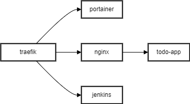

# Projectopdracht

Welkom bij het de repository voor de doorlopende opdracht van DevOps. 

Traefik is de reverse-proxy die het verkeer delegeerd naar de verschillende services.

TLS certificaten worden via CloudFlare aangereikt als dns challenge, waarna elke achterliggende service een self-signed certificate krijgt. Traefik is zodanig geconfigureerd dat het alle verkeer naar de juiste service leidt, afhankelijk van de ingestelde route-regels. Het gebruikt de service labels om de verzoeken correct te routeren. 

De self-signed certificaten van elke service worden gebruikt voor de beveiligde verbinding tussen de client en de service. Ondanks dat de certificaten self-signed zijn, zijn ze veilig aangezien ze intern binnen het netwerk worden gebruikt en niet publiekelijk beschikbaar zijn. 

Voor een extra laag van beveiliging, worden alle verzoeken die via Traefik gaan eerst geverifieerd. 

## Architecture

## Componenten

- Portainer: [portainer](https://portainer.mlcrosoft-online.site)
- Todo applicatie [Todo-app](https://todo.mlcrosoft-online.site/)
- Jeknins [Jenkins CI/CD](https://jenkins.mlcrosoft-online.site/)

